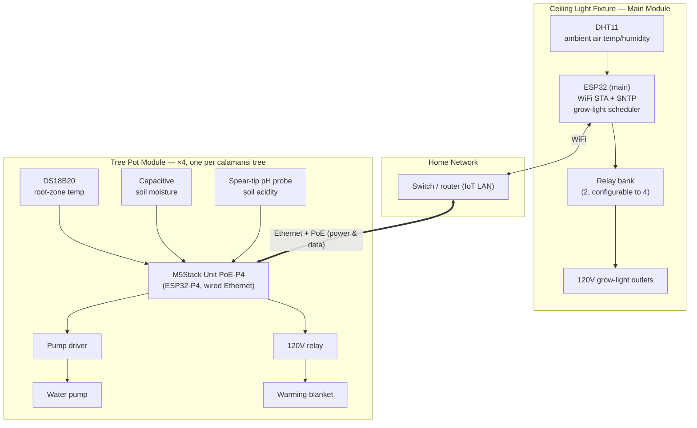

GPIO for 

## Project Layout
* `src/` — the active firmware (ESP-IDF project), under development now.
* `samples/relay-demo/` — the original single-relay blink/wifi/sntp demo, left working as reference (see its own README's "Learnings" section for the relay wiring gotchas discovered there).
* `samples/gists/` — a reference ESP32 web-relay-control Arduino sketch, kept for ideas toward a future web-managed schedule.
* `vendor/` — untracked, local-only: full ESP-IDF checkout, Arduino ESP32 core, ESPAsyncWebServer. Used for building/reference, not shipped.
* `scripts/deploy.sh` — rsyncs the repo to the Pi ("watering-can", USB-attached to the ESP32) and builds/flashes it there; see the script header for usage and overridable env vars (remote host/path, ESP-IDF export.sh location, serial port).

## System Diagram
One main module in the ceiling light fixture; one module per tree pot for sensing and local water/heat control. The pot modules are wired Ethernet + PoE (M5Stack Unit PoE-P4 — 3 owned, 1 more to buy) rather than WiFi, since the garage they'll run in already has a switch and dedicated Ethernet runs.

## Roadmap
Building this iteratively since only a couple of dev boards are wired up at a time — each phase gets flashed and tested on real hardware before moving to the next.

1. **Grow light scheduling** — `src/` has a first pass: 2 relays (configurable up to 4) driving 120V grow-light outlets on a daily on/off schedule (Kconfig-configurable hours/minutes), reusing the WiFi+SNTP time sync proven in the demo. **Status: validated on hardware.**
2. **Tree sensor monitoring** — temperature, moisture, and acidity per calamansi tree, for up to 4 trees (configurable). Sensor hardware now picked (see Hardware below); drivers not yet written.
3. **Automatic watering** — trigger a water pump relay when a tree's moisture reading is low.
4. **Root warming** — trigger a relay for a 120V warming blanket when a tree's root-zone temperature is cold.
5. **Remote schedule management** — a small web service (ESPAsyncWebServer is vendored as a candidate) to configure schedules/thresholds without a reflash.

## TODOs
* fully isolate ESP32 from relay/mains side (see [Learnings](#learnings))
* look up the Unit PoE-P4's exact GPIO/ADC pinout (Hat2-Bus header) for wiring the sensors + relays — see `hardware_bom.md`
* validate one Unit PoE-P4 node end-to-end at the sensors stage before wiring up the other 3
* Unit PoE-P4 runs ESP32-P4 (RISC-V, no built-in WiFi/BT, different chip family from the ESP32 in `src/`) — pot-module firmware will need its own `idf.py set-target esp32p4` project; plan to share `relay_controller`/sensor components between the two rather than duplicating
* pilot the recommended soil pH sensor on one tree before buying 4 more at ~$99 each (see `hardware_bom.md`)
* add a voltage divider for the pH sensor's 0–4V output before wiring to the ESP32 ADC (max 3.3V input)
* water pump relay + plumbing
* warming blanket relay + wiring
* housing for esp32s and sensors?
  * electrical box?
  * 3D print???
  * lots of electrical tape????
  * waterproof enclosures specifically for the 4 pot modules (near soil/water)
* configuration file / web service for schedule + thresholds (see Roadmap #5)
* think about water management / flooding

## Learnings
* GPIO silkscreen labels on this board match the actual GPIO numbers 1:1 (e.g. the pin printed "D25" is GPIO25) — confirmed by watching a multimeter toggle in sync with the serial log while the firmware ran. An earlier comment assuming an off-by-one ("GPIO is n-1") was wrong.
* The relay module needs 5V on VCC to power the coil driver. Pulling the VCC/JD-VCC jumper to give the coil its own dedicated supply works, but the module only has one shared GND pin (no separate GND for JD-VCC) — that dedicated supply's ground still has to tie into the same ground as the ESP32/Pi/module, or the coil has no return path. Misleading failure mode: the opto-isolator LED still lights even when the coil circuit is broken this way. Keeping the jumper in place is the simplest correct wiring unless true isolation gets implemented (see TODO above).
* The relay is active-LOW: driving IN LOW energizes it (COM switches NC → NO); HIGH or floating at boot leaves it de-energized. The firmware's "ON"/"OFF" log labels are currently inverted relative to this.
* DHT11 only measures ambient air temperature/humidity — it doesn't substitute for root-zone soil temperature or soil moisture, both of which need their own per-tree sensors (DS18B20 and a capacitive moisture sensor, respectively).

## Hardware
Full itemized parts list with quantities, costs, and purchase links lives in [`hardware_bom.md`](hardware_bom.md), kept up to date as decisions get made. Summary:

### Development / Prototype BOM
* LAFVIN ESP32 basic starter kit (ESP32 dev board, dual relay module, breadboard, jumper wires) — owned
* Breadboard power supply module — owned
* DHT11 temperature/humidity sensor — owned (×1, ambient air near the light fixture)
* Raspberry Pi ("watering-can") — used to flash/monitor the ESP32 over USB
* Still needed to prototype phases 2–4: 1× DS18B20 waterproof probe, 1× capacitive soil moisture sensor, 1× soil pH sensor, 1× small water pump, 1× 120V warming blanket/heat mat

### Production BOM (4 trees + 1 light fixture)
* 1× main ESP32 module (ceiling fixture)
* 1× relay bank for grow lights (2–4 channels)
* 4× pot controller modules — M5Stack Unit PoE-P4 (3 owned, 1 to buy)
* 4× each of: DS18B20 probe, capacitive soil moisture sensor, soil pH sensor, water pump + driver, 120V relay + warming blanket
* Enclosures: 1 for the ceiling module, 4 waterproof enclosures for the pot modules

See [`hardware_bom.md`](hardware_bom.md) for the itemized version with costs and links.
